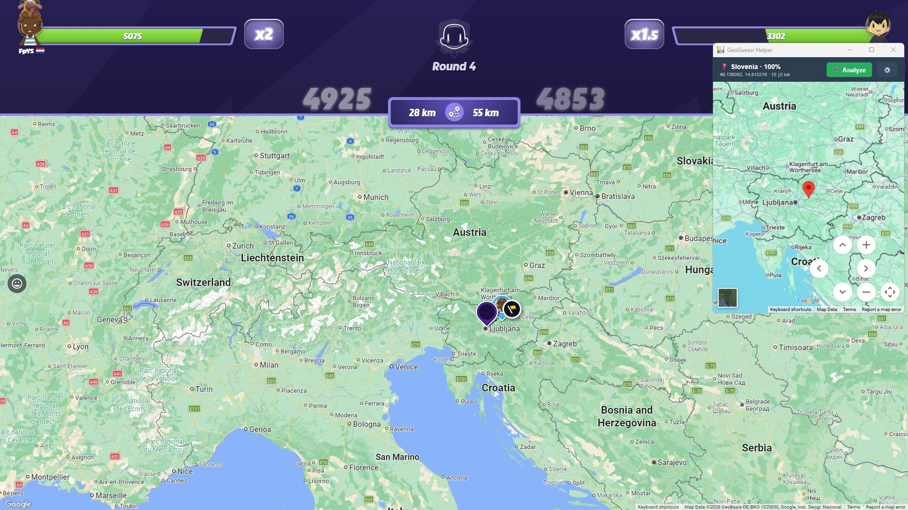
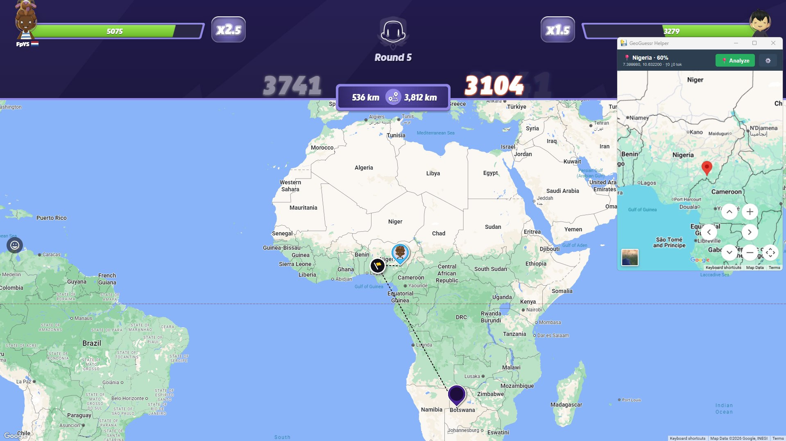

# GeoGuessr Helper

Windows overlay that uses Gemini AI to analyze your GeoGuessr screenshot and show the detected location on Google Maps.

## Usage

1. Download `GeoGuessr-Helper.exe` from [Releases](../../releases)
2. Run it — enter your [Gemini API Key](https://aistudio.google.com/apikey) on first launch
3. Click **Analyze** or press `Ctrl+Alt+G` while in GeoGuessr
4. The app captures the screen, analyzes it, and shows the location on the map

## Settings

Click ⚙️ in the app to change API key, model, or hotkey.

Config and logs are stored in `%LOCALAPPDATA%\GeoGuessr-Helper\`
